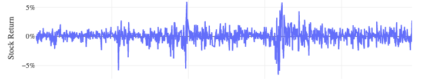
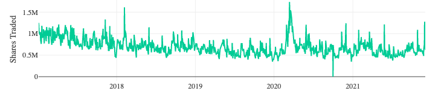
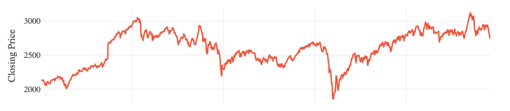
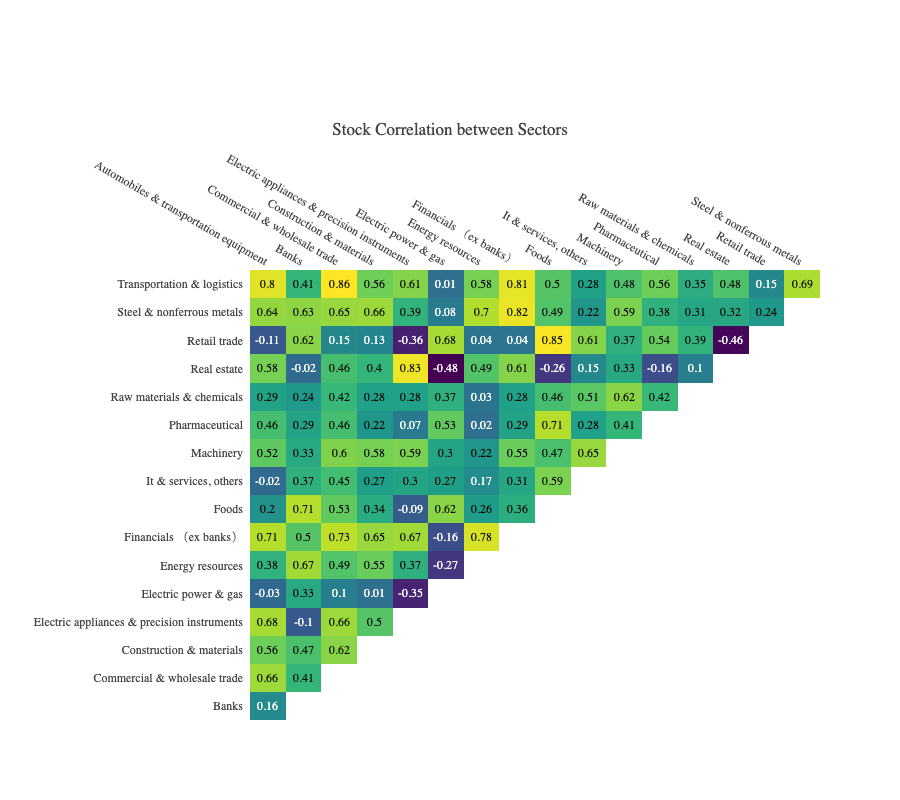
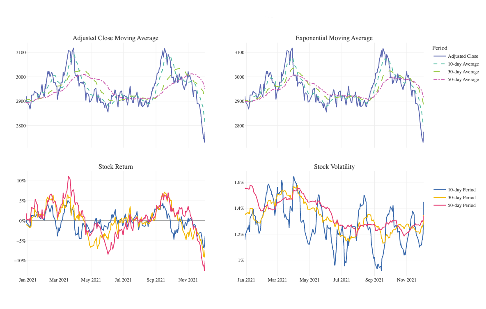

# JPX-Tokyo-Stock-Exchange-Prediction

Japan Exchange Group, Inc. (JPX) is a holding company operating one of the largest stock exchanges in the world, Tokyo Stock Exchange (TSE), and derivatives exchanges Osaka Exchange (OSE) and Tokyo Commodity Exchange (TOCOM).
There are plenty of existing quantitative trading efforts used to analyze financial markets and formulate investment strategies. To create and execute such a strategy requires both historical and real-time data, which is difficult to obtain especially for retail investors. This Repo will provide financial data for the Japanese market, allowing retail investors to analyze the market to the fullest extent.

## Market Analysis

- JPX Market Average Stock Return

- JPX Market Average Share Traded

- JPX Market Average Closing Price

- Correlation Among all Sector

- Adjusted Close Moving Average , Exponential Moving Average ,Stock Return , Stock Volatility for a Sector (Food Sector)

